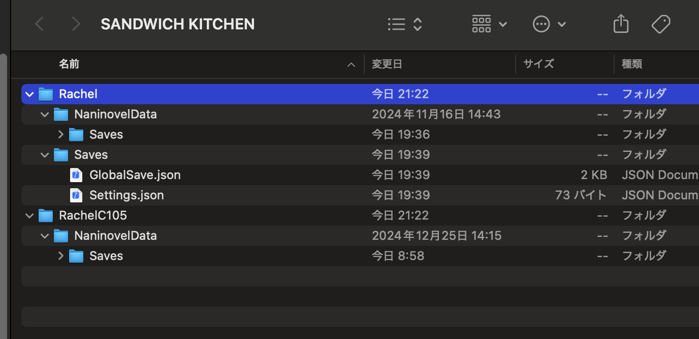

# NaninovelSaveDataInspector

Naninovelでビルドしたセーブデータが格納されている場所にすぐアクセスしたり、消したりするためのUnityEditor拡張。

## Usage
Window->`Package Manager`->`Install package from git URL` で開く

git+ssh://git@github.com/tunacook/NaninovelSaveDataInspector.git を指定

-----

## Features

### ShowSaveData

Finderでビルドごとのセーブデータが入っている場所を開く

つまりUnityの[Application.persistentDataPath](https://docs.unity3d.com/ja/2020.2/ScriptReference/Application-persistentDataPath.html)

### ClearAllSaveData

ShowSaveDataにあるディレクトリを全て削除する
